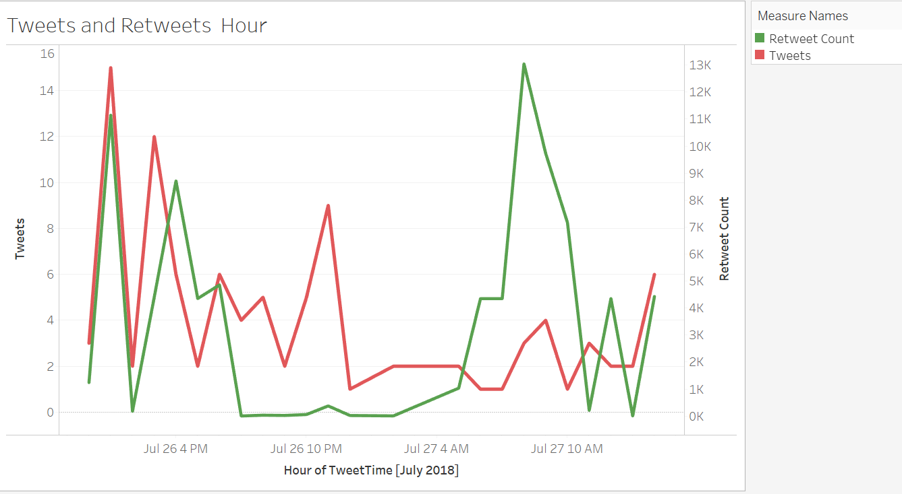
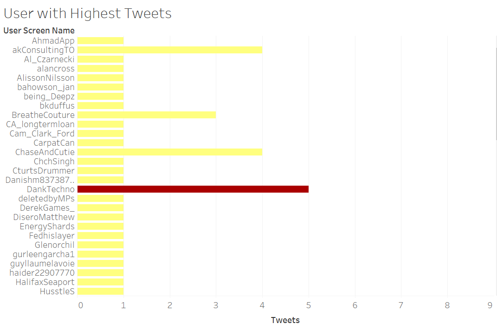
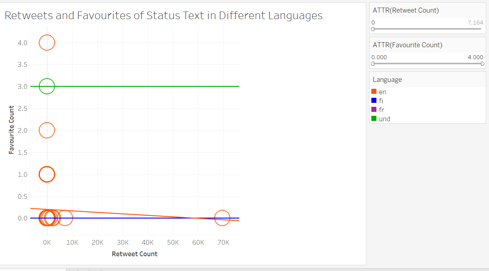

# Twitter Data Visualization for hashtag #canadaday using Tableau

The twitter hashtag data was collected from the link http://files.tableaujunkie.com/twittersearch/twitterwebconnect.html 
by using Web Data Connector Option in Tableau and Data Visualization was done for the below scenarios:

1. Number of Tweets and Retweets for the hashtag on an hourly basis

2. User having  maximum tweets for the hashtag #canadaday

3. Retweets and Favourites of the status text in different languages.

